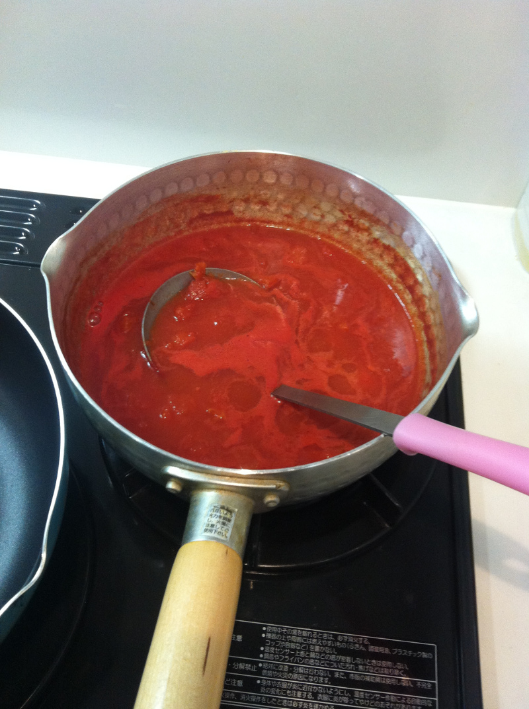
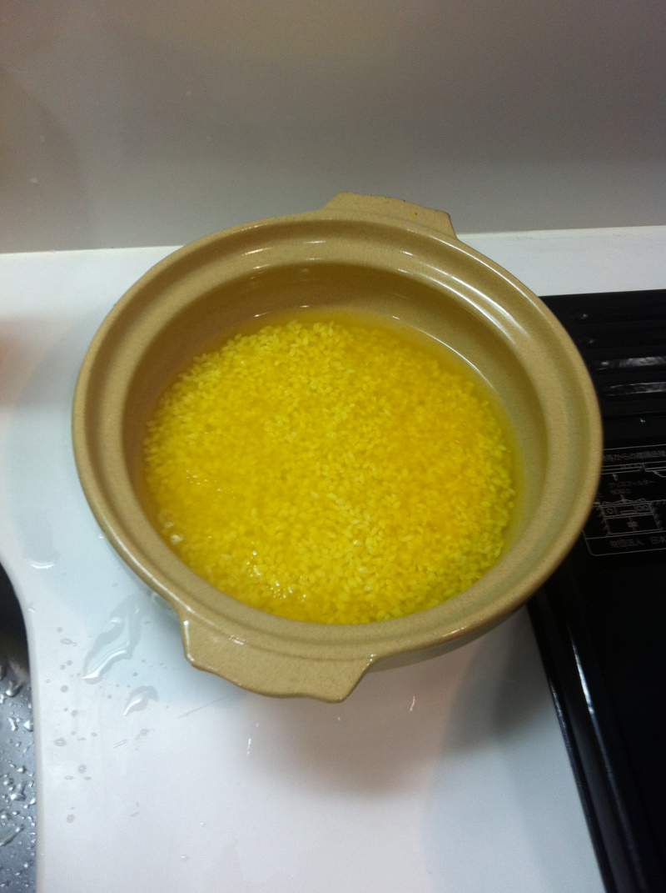
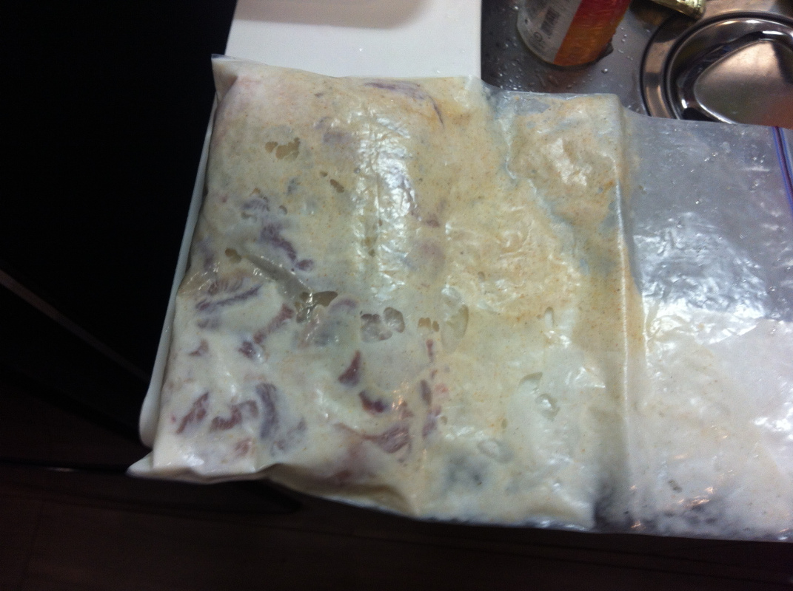
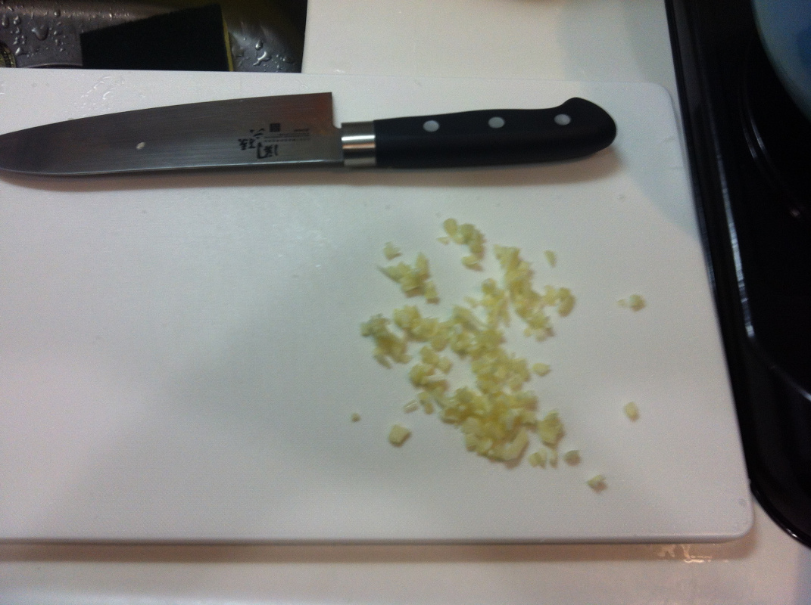
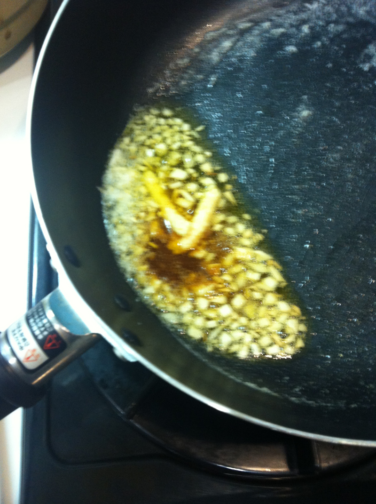
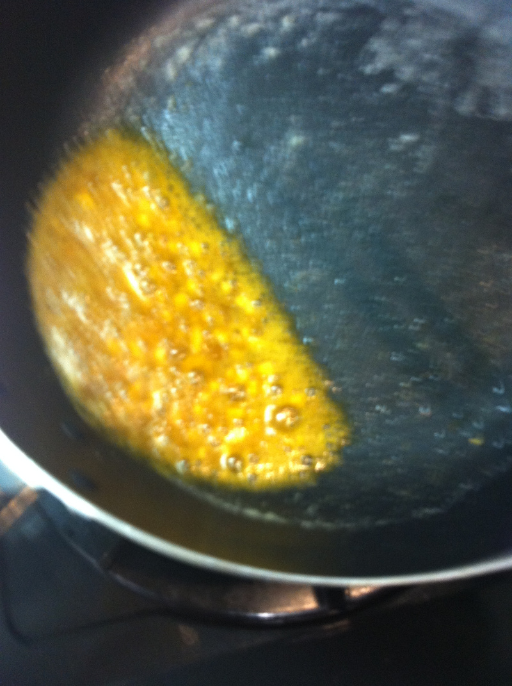
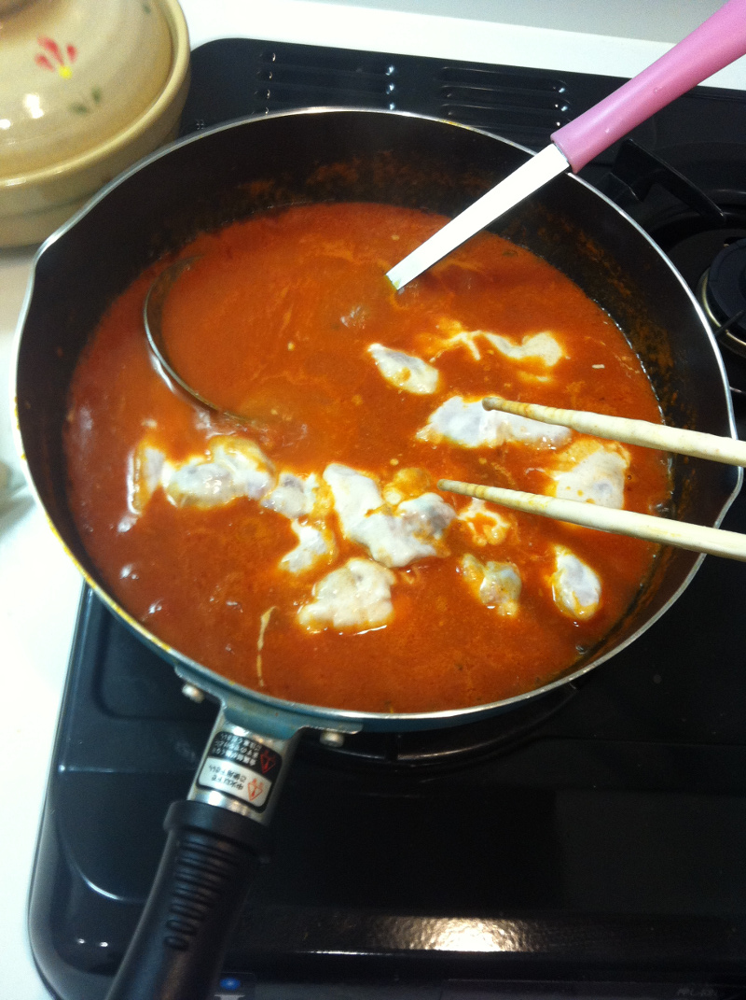
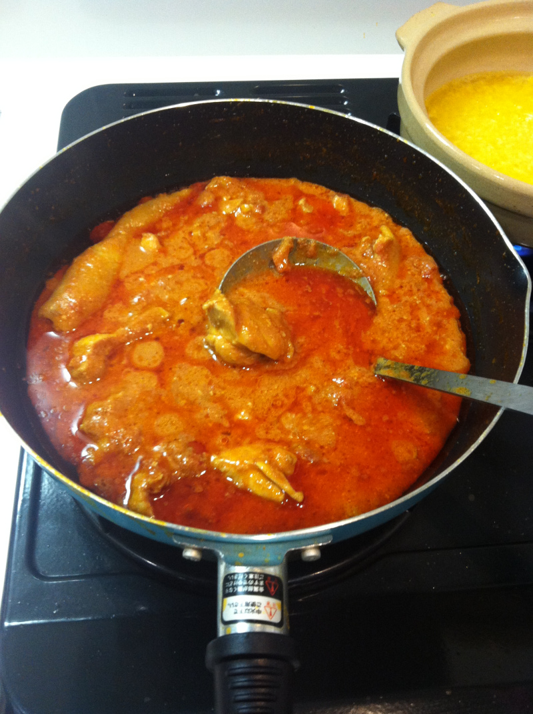
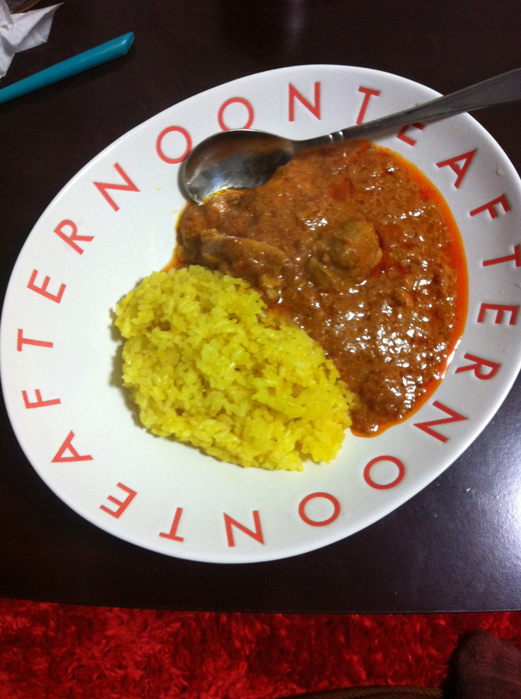

================================
バターチキンカレー
================================

バターチキンカレーの作り方

トマトホール缶を先に煮詰めておく(酸味を取るため)

米1合にターメリック小さじ1、オリーブ油、塩コショウを少々入れて炊く。
強火に火を入れて煮立ったらフタ押して弱火にして10分。あとは蒸らしで10分。

鶏もも肉2~300gにヨーグルト大さじ4，5、ガラムマサラ小さじ1~2、塩コショウ適量入れて揉み、1時間弱つけ置く。

にんにくをみじん切りにする

バターを60g溶かし、にんにくをじっくり弱火で加熱する。
ひと通り温まったらクミンシードを小さじ1~2入れてさらに煮詰める。
ターメリック小さじ1、ガラムマサラ小さじ2、生姜チューブ10cmほど入れてひたすらにつめる。

良い感じのドロドロペーストになったらOK。

煮詰めていたホールトマトを入れて煮立たせる。
煮立ったら先ほどの鶏肉を入れる。
牛乳を50~100ccほど、バターを30~50gいれる。
あとはオリーブ油、塩コショウ、ガラムマサラ、ターメリック、クミンシードを好きなようにいれる。

あとは好きなだけ煮る。

良い感じに盛り付けて完成。

参考文献
================

* https://www.sbfoods.co.jp/recipe/detail.php?rcd=04105
* http://cookpad.com/recipe/2849169
* http://cookpad.com/recipe/3062335
* http://cookpad.com/recipe/2537422
* http://cookpad.com/recipe/2945958
