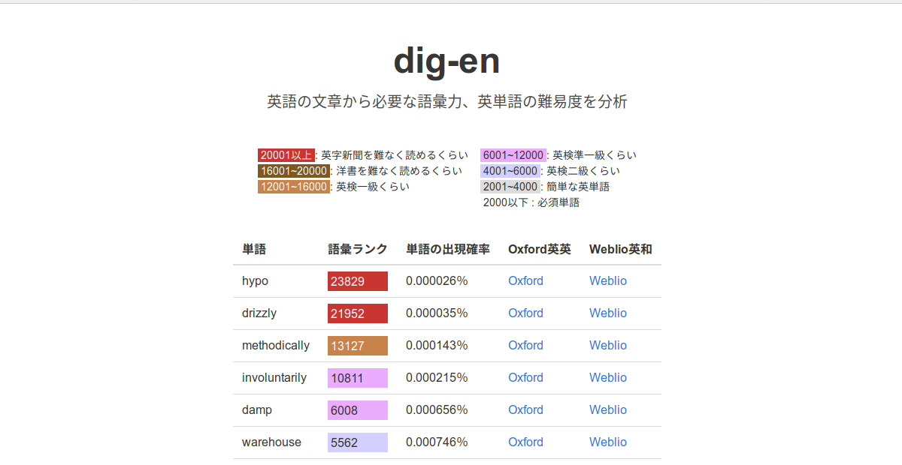
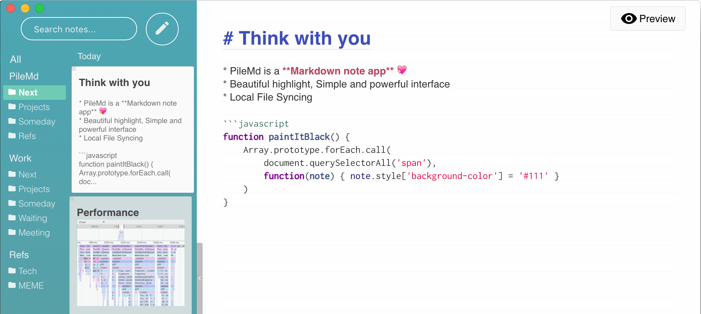

My projects
===========

Here, you can find all of my projects, created application, libraries, utility tools and so on.
If you have some question or find some bugs, please :ref:`contact` me
or make a ticket at own issue tracker. All of my projects are hosted on :ref:`repositories`.

dig-en.com
-------------------

`dig-en.com <https://dig-en.com/>`_ is a Web service for english-learners, which will analyses english sentences and display difficulties each words.

PyQ
-------

.. image:: _img/pyq.png
   :width: 800px
   :target: https://pyq.jp/

`PyQ <https://pyq.jp/>`_ is an online platform to lean Python.
It has been as my job on `BeProud <http://berpoud.jp>`_. and I and my team created this from Zero to One.

Native Apps
-----------

`PileMd <https://pilemd.com/>`_

`PileMd <https://pilemd.com/>`_ is a Markdown Note App with Beautiful Markdown Editor and Comfy Notes.

Books
-----

Books I wrote or joined.

.. raw:: html

    <iframe style="width:120px;height:240px;" marginwidth="0" marginheight="0" scrolling="no" frameborder="0" src="//rcm-fe.amazon-adsystem.com/e/cm?lt1=_blank&bc1=000000&IS2=1&bg1=FFFFFF&fc1=000000&lc1=0000FF&t=hirokikywww-22&o=9&p=8&l=as4&m=amazon&f=ifr&ref=as_ss_li_til&asins=4774192228&linkId=a168686545cb5a483acf8f9866cb1de8"></iframe>

.. raw:: html

    <iframe style="width:120px;height:240px;" marginwidth="0" marginheight="0" scrolling="no" frameborder="0" src="//rcm-fe.amazon-adsystem.com/e/cm?lt1=_blank&bc1=000000&IS2=1&bg1=FFFFFF&fc1=000000&lc1=0000FF&t=hirokikywww-22&o=9&p=8&l=as4&m=amazon&f=ifr&ref=as_ss_li_til&asins=B00ZR7WZOU&linkId=09e53dcea03d7477d2574bd68a7aa70b"></iframe>

.. raw:: html

    <iframe style="width:120px;height:240px;" marginwidth="0" marginheight="0" scrolling="no" frameborder="0" src="//rcm-fe.amazon-adsystem.com/e/cm?lt1=_blank&bc1=000000&IS2=1&bg1=FFFFFF&fc1=000000&lc1=0000FF&t=hirokikywww-22&o=9&p=8&l=as4&m=amazon&f=ifr&ref=as_ss_li_til&asins=B00XZTYMG6&linkId=050eee7eeb65cdfe72d78eec682b6fb1"></iframe>

PebbleTime
----------

`color face <http://apps.getpebble.com/en_US/application/55ceafbeb7ea50ac4c000069>`_

Graceful time and glittering effects on your wist.

You can see

* Current Time
* Day and Day of the Week
* Battery Life

`the Hour <http://apps.getpebble.com/en_US/application/55be1acc7747d0d7bf000049>`_

the Hour. simple, clean and enough Watchface.

Libraries
---------

`dripper <https://pypi.python.org/pypi/dripper>`_
    A utility library to clean up messy dictionary data.
`django-reportmail <https://pypi.python.org/pypi/django-reportmail>`_
    A django library to send ‘report’ mail. Almost django management commands used
    as night batch processing, and then, administrators will want to know the result as mail.
    If you want to notice results of some django commands, download and try it.
`matcha <https://pypi.python.org/pypi/matcha>`_
    A WSIG dispatcher like Django's URL dispatcher. But it won't parse URL patterns as regexp.
`django-websettings <https://pypi.python.org/pypi/django-websettings>`_
    A django application to provide a web interface to set a yet another django’s settings.
    `django-constance <https://pypi.python.org/pypi/django-constance>`_ is a similar project
    and It seems better than mine.
`raven-django-newauth <https://pypi.python.org/pypi/raven-django-newauth>`_
    Raven client to correspond to User object of
    `django-newauth <http://ianlewis.bitbucket.org/django-newauth/>`_.
    But actually, now it's not good idea to use django-newauth,
    Cause you can use custom user models, if you use django 1.5 or higher.

Command line tools
------------------

`mkbasicauth <https://github.com/hirokiky/mkbasicauth>`_
    A command line tool to generate Basic auth credentials.
`genaa <https://pypi.python.org/pypi/genaa>`_
    An ASCII-Art generator.

Services
--------

`Karmaid <https://github.com/hirokiky/karmaid/>`_
    (not available)
    Karma ++/-- for everything. You can do increment or decrement for some ascii strings
    and create buttons for ++/--.
    The source code is on GitHub https://github.com/hirokiky/karmaid/
Pushosu
    (not available)
    Provide buttons to tweet boilerplate sentences.
Sinboon
    (not available)
    A web feed reader to consider user's liking and filtering
    articles user may not be interested in.

Experimental
------------

`Uiro framework <https://pypi.python.org/pypi/uiro>`_
    A full stack framework of Python to aim be more flexible than Django and more kind than Pyramid.
`gargant.dispatch <https://pypi.python.org/pypi/gargant.dispatch>`_
    An experimental WSGI dispatcher.
`django-yacbv <https://pypi.python.org/pypi/django-yacbv>`_
    A replacement of Django's ClassBasedView. It's experimental and no for production usage.
    I've been captivated by Views of Pyramid, so I created it.
`django-beautifulpredicates <http://pypi.python.org/pypi/django-beautifulpredicates/>`_
    An experimental django library to provide 'predication' for views. It aims similar goal with
    django-yacbv. It maybe my the first package uploaded to PyPI by me.
