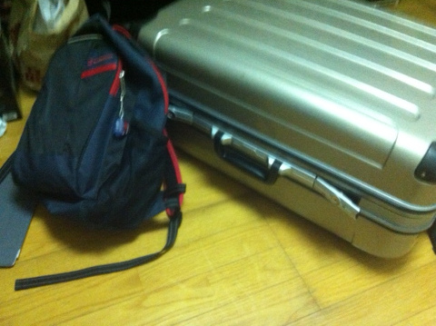
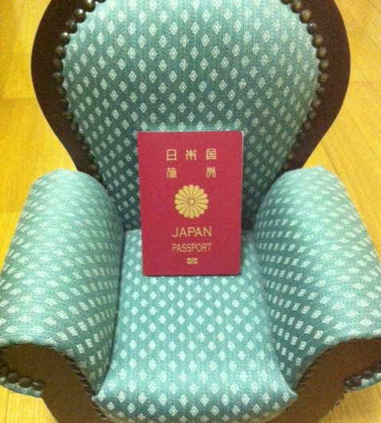

Preparing for trip to Berlin
============================

:Page Status: Complete
:Last Reviewed: 2014-07-16

This is the first page in the EuroPython2014 report.
The series page is :doc:`index`

This is my first trip for Berlin, and also first trip for foreign country.
so I'll leave some memo.

Saving money
------------
Even if you want to join some conferences, you can't so without money.
The first thing I did is saving money. Actually Berlin is really far from Japan,
so It takes expensive airfare.
From Japan to Berlin, I choose Finnair for the flight. and It costs about 150,000 yen.

(I forgot to apply the financial assistance. If a conference you want to join support you,
it may be good idea to apply. Assistance of EuroPython is like this
`Financial Assistance <https://ep2014.europython.eu/en/registration/financial-assistance/>`_.

Getting Ticket
--------------
Of cause this is also necessary thing.
I want to go to Euro and Berlin, so I choice this conference.
But there's a lot of excellent and interesting events. US, Canada, AU, Taiwan, Singapore, and
Japan for example. In Tokyo PyCon JP 2014 will be held from September 12-15. If you are interested
in Japan and Japanese Python community, please register. https://pycon.jp/2014/ I'll join and make presentation.

Booking Hotel and Flight
------------------------
I recommend you to go to some travel agency, because It's really ease.
I don't have enough experience to go to foreign country but the agency guided me kindly.
I choose H.I.S, one of travel agencies in Japan, was great.
Of cause you need pay some interest for them.

And I heard Finair is really good. not so expensive but good service.
(But, now I'm writing this article before the trip, so the actual reputation is hidden)

Getting Passport
----------------
This process was really really messy for me. Cause it requires me to write some official documentations.

Luggage
-------
What should I pack into the luggage? I don't know, right now.
but seems it's enough with them:

* Ticket
* Laptop
* Wifi router
* Clothes

maybe.
